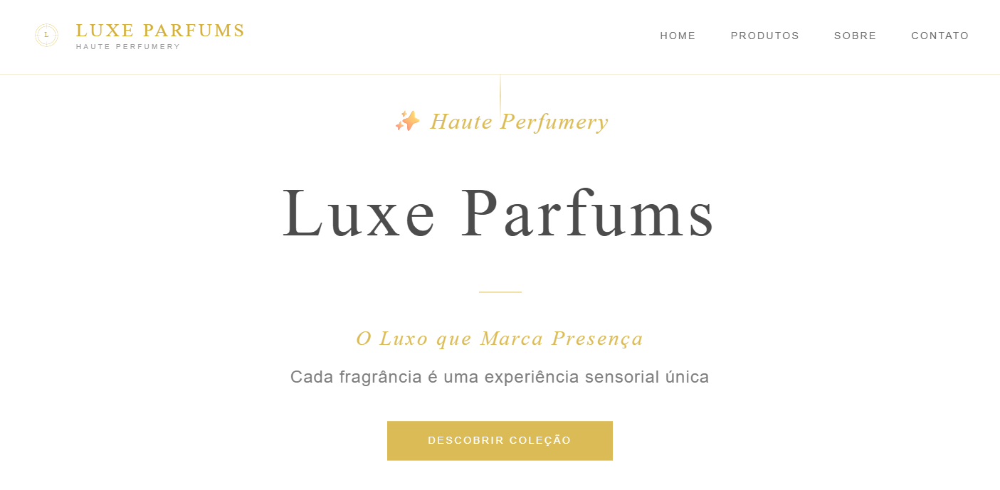
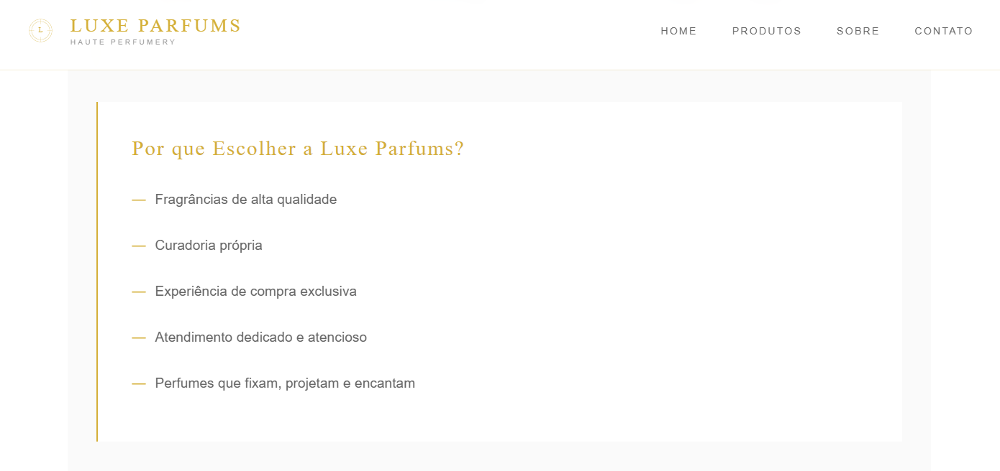

# 💎 Luxe Parfums - Haute Perfumery

## 📋 Sobre o Projeto <br>

**Luxe Parfums** é um site elegante e sofisticado desenvolvido para representar uma boutique de perfumes de luxo. O projeto combina design minimalista premium com funcionalidades modernas, criando uma experiência de navegação refinada que reflete a exclusividade dos produtos de alta perfumaria.


<div align="center">



O Luxo que Marca Presença
Demo • Características • Tecnologias • Instalação
</div>


### 🎯 Objetivo

Criar uma presença digital elegante para marcas de luxo, oferecendo uma interface que transmite sofisticação, qualidade e exclusividade através de cada elemento visual e interativo.

---

## ✨ Características

- 🎨 **Design Premium**: Interface minimalista com paleta dourada (#d4af37) e tipografia elegante
- 📱 **100% Responsivo**: Perfeito em todos os dispositivos - desktop, tablet e mobile
- ⚡ **Animações Sofisticadas**: Transições suaves e efeitos fade-in escalonados
- 🔍 **Filtro Inteligente**: Sistema de categorização dinâmica por coleções
- 💬 **Integração WhatsApp**: Contato direto para consultas e compras
- 🎯 **Navegação Fluida**: Menu fixo com smooth scroll entre seções
- 🌊 **Efeito Parallax**: Parallax sutil otimizado na hero section
- 🎭 **Microinterações**: Hover effects elegantes em todos os elementos
- 🚀 **Performance**: Código otimizado e carregamento rápido

---

## 🎭 Coleções

### 🌹 Essências Clássicas
Fragrâncias atemporais que celebram o tradicional com elegância refinada.

### ⚡ Aromas Modernos  
Perfumes contemporâneos com personalidade marcante e presença envolvente.

### 👑 Luxury Edition
Linha premium de alta performance, longa duração e projeção inconfundível.

---

## 🛠️ Tecnologias Utilizadas

<div>

| Tecnologia | Descrição |
|-----------|-----------|
|  | Estrutura semântica e acessível |
|  | Estilização avançada com Grid e Flexbox |
|  | Interatividade e funcionalidades dinâmicas |
|  | Cormorant Garamond & Montserrat |

</div>

### 📦 Recursos Técnicos

- **CSS Grid & Flexbox** - Layout responsivo moderno
- **CSS Animations** - Animações performáticas
- **Vanilla JavaScript** - Sem dependências externas
- **SVG Graphics** - Ícones vetoriais escaláveis
- **RequestAnimationFrame** - Animações otimizadas
- **Mobile-First Design** - Abordagem responsiva

---

## 📁 Estrutura do Projeto

```
luxe-parfums/
│
├── assets/
│   ├── imagem-projeto1.png    # Screenshot desktop
│   └── imagem-projeto2.png    # Screenshot mobile
│
├── index.html                 # Página principal
├── styles.css                 # Estilos e animações
├── script.js                  # Funcionalidades JavaScript
└── README.md                  # Documentação
```
---

## 📱 Responsividade

O site é totalmente responsivo com breakpoints otimizados:

| Dispositivo | Resolução | Layout |
|------------|-----------|--------|
| 🖥️ Desktop | > 968px | Grid 3 colunas |
| 📱 Tablet/Mobile | ≤ 968px | Grid 1 coluna + Menu hamburguer |

### Funcionalidades Mobile

- ✅ Menu hamburguer animado
- ✅ Touch-friendly buttons
- ✅ Imagens otimizadas
- ✅ Tipografia escalável
- ✅ Navegação por gestos

---

## 🌟 Funcionalidades Detalhadas

### 🎯 Sistema de Filtros
```javascript
// Filtragem dinâmica por categoria
filtrarProdutos('Clássicas')  // Mostra apenas clássicos
filtrarProdutos('Todos')      // Mostra todos os produtos
```

### 💬 Integração WhatsApp
```javascript
// Mensagem personalizada por produto
abrirWhatsApp('Rose Impériale')
// Abre: "Olá! Gostaria de conhecer mais sobre o perfume: Rose Impériale"
```

### 🎭 Animações
- **Fade-in Escalonado**: Produtos aparecem com delay progressivo
- **Hover Effects**: Bordas e transformações suaves
- **Parallax Hero**: Movimento sutil no scroll
- **Smooth Scroll**: Navegação fluida entre seções

---

## 🔮 Futuras Melhorias

- [ ] Sistema de carrinho de compras
- [ ] Integração com API de pagamento
- [ ] Cadastro de newsletter
- [ ] Sistema de avaliações
- [ ] Busca por produtos
- [ ] Modo dark theme
- [ ] Galeria de imagens dos produtos

---

## 👩‍💻 Autora

<div>

**Desenvolvido com 💜 por Danielly Pedrini**

<a href="https://www.linkedin.com/in/daniellypedrini/" target="_blank">
  
</a>

<a href="https://wa.me/5515991563363" target="_blank">
  
</a>

<a href="mailto:Daniellypedrini@outlook.com" target="_blank">
  
</a>

<a href="https://github.com/danielly-pedrini" target="_blank">
  
</a>

---

### ✨ Desenvolvido com dedicação para proporcionar elegância e sofisticação ✨

**Se este projeto foi útil para você, considere dar uma ⭐**

---

<sub>Este projeto faz parte do meu portfólio profissional</sub>

</div>
